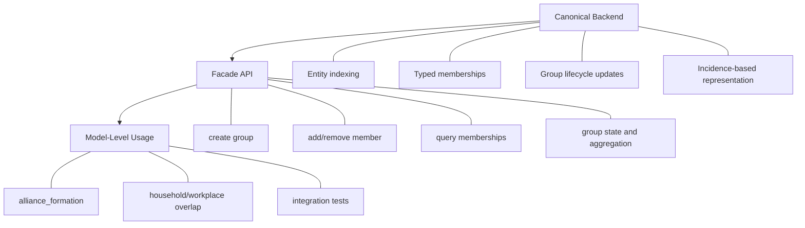
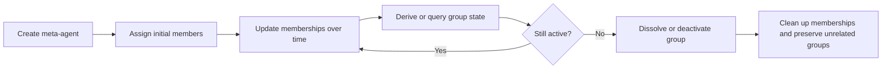
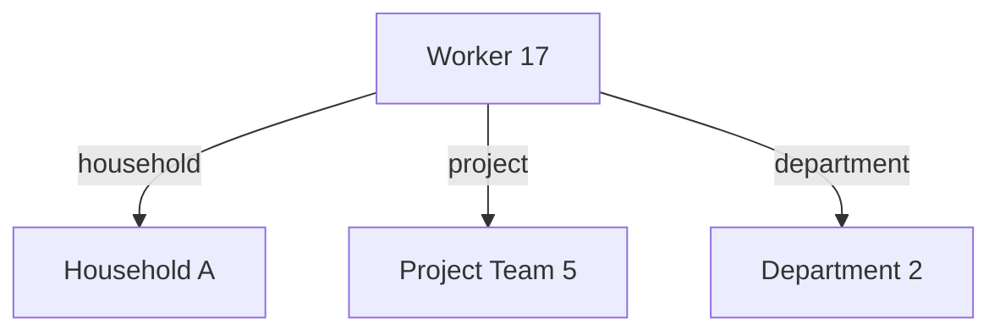

# Hypergraph-Based Meta-Agents for Mesa
## GSoC 2026 Proposal Draft

Detailed draft for `@falloficarus22`, based on the structure and level of detail used in the accepted Mesa-LLM proposal, while aligning with the current maintainer direction in Mesa discussion `#3403`.

This draft is intended to become the source for the final PDF submission.

## Synopsis

This proposal aims to design and implement the canonical architecture for meta-agents in Mesa, following the direction currently established in discussion `#3403`: a hypergraph-style conceptual basis, an incidence-tensor-oriented backend, and a facade-style API for users. The project focuses on building the core representation for overlapping group structure, typed memberships, lifecycle handling, and group-level state aggregation, then exposing that architecture through a Mesa-native public interface. The expected result is a more principled and maintainable foundation for multi-level modeling in Mesa, validated through tests, documentation, and example-driven integration.

## Candidate Metadata

- Name: `Abhishek Sanjay Shinde`
- GitHub: `falloficarus22`
- Email: `norizzabhii@gmail.com`
- Country of Residence: `India`
- University: `Amrutvahini College of Engineering`
- Degree / Program: `Mechanical Engineering (former undergraduate study)`

## Table of Contents

1. Project Overview
1.1. Introduction and motivation
1.2. Benefits to the Mesa community
1.3. Scope and philosophy
1.4. Non-goals

2. Technical Approach
2.1. Problem framing
2.2. Architecture and API design
2.3. Canonical backend design
2.4. Facade API and user interaction model
2.5. Lifecycle, behavior rules, and state handling
2.6. Testing, validation, and performance
2.7. Community alignment and feasibility
2.8. Deliverables and outcomes

3. Timeline
3.1. Community bonding phase
3.2. First coding phase
3.3. Second coding phase
3.4. Final polishing phase

4. Risks and Mitigation
4.1. Backend representation remains underspecified
4.2. Scope expands too far into advanced behavior
4.3. User-facing API becomes less clear than the backend
4.4. Performance goals distract from architectural correctness

5. Background and Experience
5.1. About me
5.2. Relevant technical background
5.3. Contributions and preparation
5.4. Why I am a strong fit for this project
5.5. Long-term vision

6. Appendix
6.1. References

## 1. Project Overview

### 1.1. Introduction and Motivation

Mesa already contains an experimental meta-agent capability, but the current implementation is not yet a sufficiently general or stable foundation for modeling multi-level systems. In many domains, agents do not only exist as isolated individuals. They also belong to larger structures such as alliances, institutions, households, firms, teams, coalitions, and communities. These structures may overlap, change over time, and influence both individual and collective behavior.

This is exactly the kind of modeling challenge that meta-agents are meant to address. However, the current experimental implementation does not yet fully answer some central questions:

- what is the right conceptual foundation for overlapping group structures,
- how should memberships be represented internally,
- what lifecycle rules should groups follow,
- how should users interact with these concepts in a way that feels natural in Mesa,
- and how can all of this be done while remaining computationally robust?

The current discussion in the Mesa repository has made the direction more concrete. The architecture being discussed by maintainers is:

- a hypergraph-style conceptual basis,
- a canonical backend based on incidence tensors,
- and a facade-style user-facing API.

This proposal is built directly around that direction. The project is therefore not framed as a general refactor in the abstract, but as the design and implementation of the core architecture on which future meta-agent functionality in Mesa can be built.

The central objective is to provide a principled, maintainable, and user-oriented meta-agent substrate that can support overlapping memberships, typed group relationships, and explicit lifecycle operations, while remaining aligned with Mesa's broader design philosophy.

This direction is also closely connected to my previous Mesa work. I have already contributed directly to the meta-agent subsystem through `PR #3172`, which added support for multiple and overlapping meta-agent memberships. That experience made it clear to me that overlapping group structure is one of the central architectural pressures on this module, and it is one reason I want to work on the deeper backend and API questions now being discussed.

### 1.2. Benefits to the Mesa Community

This project would benefit Mesa in several ways.

First, it would provide a clearer foundation for multi-level modeling. Users would be able to express group structures more naturally without resorting to one-off patterns for each model.

Second, it would improve maintainability. A canonical backend with clear behavior rules would reduce ambiguity both for users and for future contributors extending the module.

Third, it would enable new categories of models. Meta-agents are relevant to a wide range of domains:

- social systems with families, coalitions, or institutions,
- organizational and economic systems with firms, departments, and markets,
- political or conflict models involving alliances and blocs,
- and complex adaptive systems with nested or overlapping structures.

Fourth, it would create a foundation for future extensions. Once a rigorous representation exists, richer group-level behavior, aggregation logic, and interaction mechanisms can be built on top of it in a more systematic way.

Finally, it would turn the current experimental direction into a more mature and coherent Mesa capability, making the framework more attractive for users interested in multi-level or relationally rich simulations.

### 1.3. Scope and Philosophy

The most important design constraint for this project is alignment with the maintainers' current direction. Based on the recent discussion, the architecture should aim for:

- one canonical backend, not multiple competing backend implementations,
- a mathematically grounded internal representation,
- and a user-facing interface that hides backend complexity.

This is an important constraint because it narrows the project in a productive way. The goal is not to build every possible meta-agent feature during GSoC. The goal is to build the correct foundation first.

That means this proposal prioritizes:

- architectural coherence over feature count,
- explicit behavior rules over informal conventions,
- maintainability over experimental complexity,
- and meaningful integration with Mesa's existing style and user expectations.

This also affects what is intentionally out of scope. For example, highly advanced behavior layers inspired by external tensor-logic or neuro-symbolic systems may be relevant in the future, but they should not displace the core objective of building the canonical backend and its facade interface.

In other words, the philosophy of this proposal is:

- define the architecture cleanly,
- implement the most important core operations,
- validate them through tests and examples,
- and leave the project in a state that is useful even before more advanced extensions arrive.

### 1.4. Non-goals

To keep the project realistic and aligned with current maintainer guidance, several things are intentionally not the main focus of this proposal:

- supporting multiple backend implementations for meta-agents,
- treating tensor logic or other higher-level reasoning systems as the primary architectural goal,
- attempting to implement every possible category of group behavior in one summer,
- and optimizing prematurely before the canonical representation and behavior rules are clearly defined.

This proposal is instead centered on implementing the agreed architecture first and making sure that the resulting system is usable, testable, and extensible.

## 2. Technical Approach

### 2.1. Problem Framing

Meta-agents are difficult to implement well because they sit at the intersection of several concerns:

- representation of overlapping memberships,
- lifecycle updates over time,
- relations between individual and group-level entities,
- user-facing ergonomics,
- and computational cost.

The current experimental implementation demonstrates the value of the feature, but it also shows that ad hoc handling of these concerns is not enough for long-term maintainability.

The architecture therefore needs to answer at least five questions:

1. What exactly is a meta-agent in the model representation?
2. How are memberships encoded and updated?
3. How are different types of meta-agents represented?
4. How does the user manipulate these structures through the API?
5. What invariants and behavior guarantees should Mesa provide?

The rest of this proposal is organized around answering those questions in a way consistent with the maintainers' current framing.

### 2.2. Architecture and API Design

My current interpretation of the target architecture is that it should be divided into two layers:

- a canonical backend layer for representation and update logic,
- and a facade layer that exposes a clean interface for Mesa users.

This separation is important. The backend should be designed for correctness, consistency, and efficient operations. The facade should be designed for readability, usability, and alignment with how modelers think about their simulations.

From the user's perspective, working with meta-agents should feel conceptually natural. Users should be able to think in terms of:

- creating a meta-agent or group,
- assigning membership,
- removing membership,
- querying related structure,
- and invoking or observing group-level state and behavior.

From the backend perspective, these same operations must become precise updates to the canonical representation.

This separation lets the architecture remain mathematically grounded without exposing users directly to internal data structures that would make model code harder to understand.

Figure 1: Proposed Meta-Agent Architecture



This figure shows that the project is not only a backend refactor. It is a complete stack of internal representation, user-facing access, and model-level validation.

### 2.3. Canonical Backend Design

The backend is the most important architectural part of this proposal, because it is the layer that will determine whether meta-agents in Mesa remain an ad hoc experimental feature or become a reliable foundation for multi-level modeling.

The maintainers' current direction suggests a hypergraph-style conceptual basis. I think this is the right starting point because ordinary graphs focus on pairwise relations, while meta-agents require a representation in which one agent may belong to multiple overlapping collective structures at once. A hypergraph-like view captures this naturally: meta-agents correspond to structured sets of agents, and a single agent may participate in several such sets simultaneously.

In practical Mesa terms, this means the backend should be able to represent at least four things cleanly:

- atomic agents as first-class entities,
- meta-agents as first-class entities rather than only informal containers,
- memberships between agents and meta-agents,
- and typed relationship categories such as `household`, `workplace`, `alliance`, or other user-defined meta-agent kinds.

The proposed implementation direction is an incidence-tensor-oriented backend. My understanding of this direction is not that users should manipulate tensors directly, but that the internal storage model should behave like a canonical incidence structure over all relevant entities. That gives Mesa a uniform way to represent both overlapping memberships and typed group relations.

At a high level, the backend would need to answer questions like:

- which meta-agents does a given agent belong to,
- which agents belong to a given meta-agent,
- what type of membership or relation is being represented,
- whether a meta-agent currently exists or has been dissolved,
- and how the structure changes safely over time.

This representation is especially valuable because it can unify cases that would otherwise become inconsistent if modeled separately. For example, a single agent could belong to:

- one household meta-agent,
- one workplace meta-agent,
- one alliance meta-agent,
- and later transition out of one of those groups while staying in the others.

Without a canonical representation, these operations can easily become model-specific, error-prone, or difficult to reason about. With a canonical backend, these same operations become variations of the same underlying update logic.

At the implementation level, I think the backend design should be developed around the following components.

#### Entity indexing and identity

The backend should maintain a clear indexing scheme over all relevant entities, including both atomic agents and meta-agents. This is necessary so that membership relations and typed channels can be updated consistently without relying only on ad hoc Python object references.

#### Membership representation

The core relation in the system is membership. The backend should encode membership between an agent and a meta-agent in a form that supports:

- insertion,
- removal,
- lookup by agent,
- lookup by meta-agent,
- and filtering by relation type.

This is where the incidence-tensor idea becomes especially important. Even if the final internal implementation evolves during discussion with mentors, the architectural objective should remain the same: one canonical substrate for membership and relation updates.

#### Typed relation channels

Meta-agents are not all interchangeable. A household relation and a workplace relation may both connect agents to groups, but they carry different modeling meaning. I therefore think typed relation handling should be part of the backend rather than treated as a loose convention in user code.

This means the backend should distinguish:

- plain membership,
- typed group membership,
- and possibly future extensions where different meta-agent categories carry different behavioral meaning.

#### Lifecycle support

The backend should also track enough information to support lifecycle rules. At minimum, that includes:

- creation of a new meta-agent,
- assigning and removing membership,
- querying current membership state,
- and dissolving a meta-agent without leaving stale structure behind.

Since my earlier work on `PR #3172` already touched overlapping memberships and cleanup behavior, I think this part of the design is especially important. The backend should make invalid states harder to create rather than forcing cleanup logic to remain scattered.

#### Invariants

For the backend to be dependable, it should preserve a small but explicit set of invariants. Examples include:

- no stale memberships pointing to dissolved meta-agents,
- no duplicate membership entries for the same agent/meta-agent/type combination unless explicitly allowed,
- consistent lookup from either side of the membership relation,
- and deterministic handling of updates when an agent belongs to several typed groups at once.

I think making these invariants explicit in both the implementation and the tests would be one of the biggest strengths of the project.

The exact tensor layout should remain a point of active discussion with mentors early in the project, because it is central and still not finalized in the repository discussion. However, even without fixing every low-level detail at proposal time, the project can still commit clearly to what the backend must accomplish: it must represent membership and typed relation structure canonically, support safe mutation of that structure, and remain suitable for later extension.

An illustrative backend sketch might look like:

```python
class MetaAgentBackend:
    def __init__(self):
        self.entities: dict[int, EntityRef] = {}
        self.membership = IncidenceTensor()
        self.relationship_types: dict[str, int] = {}
        self.group_state: dict[int, dict[str, object]] = {}
        self.active_groups: set[int] = set()

    def add_membership(self, agent_id: int, meta_agent_id: int, kind: str) -> None:
        ...

    def remove_membership(
        self, agent_id: int, meta_agent_id: int, kind: str
    ) -> None:
        ...

    def memberships_of(self, agent_id: int) -> list[MembershipRef]:
        ...

    def members_of(self, meta_agent_id: int, kind: str | None = None) -> list[int]:
        ...

    def dissolve(self, meta_agent_id: int) -> None:
        ...
```

This pseudocode is intentionally simple, but it reflects the design direction I want the project to follow: backend operations should be explicit, canonical, and centered on membership structure rather than hidden inside model-specific conventions.

At a more conceptual level, the backend should make it possible to answer a query like:

```python
backend.memberships_of(worker_17)
# -> [MembershipRef(group=department_2, kind="department"),
#     MembershipRef(group=project_5, kind="project")]
```

That is a small example, but it captures one of the core reasons for the new architecture: overlapping memberships should become a normal and inspectable part of the system rather than a special case.

### 2.4. Facade API and User Interaction Model

The facade layer is critical because the usability of the feature depends on it. Most Mesa users should not need to know that the backend is tensor-based in order to use meta-agents correctly. If the backend becomes rigorous but the public interface remains awkward, then the project will still fail in practice because users will continue to fall back on model-specific workarounds.

For that reason, I think the facade should be treated as a first-class design problem rather than a thin wrapper added at the end. Its role is to translate the canonical backend into operations that feel natural for Mesa users and consistent with how they already think about agents, models, and interactions.

The public interface should therefore emphasize modeling concepts rather than backend mechanics. Depending on maintainer preferences, this could involve helper classes, manager objects, explicit APIs on meta-agent classes, or a mixed approach. I do not think the proposal needs to overcommit to one exact API surface at this stage, but it should commit to the principles that the surface must satisfy.

#### Design goals for the facade

I think the facade layer should aim for the following properties:

- it should expose common operations explicitly rather than hiding them in indirect conventions,
- it should make overlapping membership easy to express,
- it should preserve Mesa-like readability in model code,
- it should remain consistent with the canonical backend behavior rules,
- and it should be understandable without requiring users to learn tensor terminology.

This matters because meta-agents are conceptually rich enough already. Users should have to think about groups, memberships, and group-level behavior, not about storage layout.

#### Core operations

At minimum, the facade should support intuitive operations such as:

- create a meta-agent of a given type,
- add one or more members,
- remove one or more members,
- inspect memberships,
- query which meta-agents an agent belongs to,
- inspect or update group-related attributes,
- and dissolve or deactivate groups in a controlled way.

I also think the facade should make typed relations visible at the API level rather than requiring users to manage them manually through generic metadata. One of the benefits of the new architecture is that group type becomes part of the actual representation rather than a naming convention, and the API should reflect that.

#### API boundary with the backend

The facade should not duplicate backend logic. Instead, it should act as the stable public boundary through which user-facing operations are translated into canonical backend updates.

For example:

- `create(...)` should map to entity creation plus initial membership registration,
- `add_member(...)` should map to a typed membership insertion,
- `remove_member(...)` should map to safe removal plus invariant checks,
- and membership queries should return user-meaningful structures rather than raw backend indices.

This separation is important because it keeps the backend authoritative while still allowing the public API to remain expressive and readable.

#### Readability in real Mesa models

One of the strongest tests for the facade is whether model code still feels like Mesa code after the feature is introduced. A good facade should let modelers express collective structure directly in their models without making the code feel mathematically overloaded.

That is why I think API ergonomics should be validated through examples, not only through implementation convenience. If the alliance formation example and a household/workplace overlap example become easier to read and reason about under the new interface, that is strong evidence that the design is working.

#### Documentation and discoverability

This layer is also where documentation quality matters most. If the backend is mathematically clean but the public API is confusing, the feature will still be hard to adopt. I therefore think the facade should be designed together with documentation examples and simple usage patterns, not documented only after the implementation is complete.

For that reason, I see the facade as more than a convenience wrapper. It is the layer that translates the architectural ideas into something that is practical for actual Mesa modeling workflows.

An illustrative facade API sketch might look like:

```python
household = model.meta_agents.create(
    kind="household",
    members=[agent_a, agent_b, agent_c],
)

model.meta_agents.add_member(household, agent_d)
model.meta_agents.remove_member(household, agent_b)

workplace = model.meta_agents.create(
    kind="workplace",
    members=[agent_a, agent_e],
)

memberships = model.meta_agents.memberships_of(agent_a)
```

This sketch is intentionally simple, but it captures the style I think the project should aim for: explicit operations, typed group structure, and model-facing code that remains easy to read even if the backend representation is mathematically sophisticated.

I also think the facade should support state-oriented operations in a similarly direct style. For example:

```python
model.meta_agents.set_group_state(household, cohesion=0.7)

energy_mean = model.meta_agents.aggregate(
    household,
    source_attr="energy",
    reducer="mean",
)
```

Even if the final API differs in detail, that kind of interaction style is what I would want the project to preserve: operations that are easy to read in a Mesa model and easy to connect back to the canonical backend rules.

### 2.5. Lifecycle, Behavior Rules, and State Handling

One of the most important parts of this project is defining the lifecycle and state rules clearly enough that the implementation remains predictable for users and maintainers. The backend and facade can be well-designed structurally, but if the system does not behave consistently when groups are created, updated, or dissolved, users will still struggle to build reliable models.

The current discussion has already raised questions in this direction, especially around how memberships should evolve over time and how group state should relate to member state.

I believe the project should define explicit rules for:

- group creation,
- membership addition,
- membership removal,
- group dissolution,
- typed group relationships,
- and how these operations affect user-visible state.

#### Lifecycle rules

The lifecycle of a meta-agent should not be left implicit. A group should have a well-defined path through:

- creation,
- active membership updates,
- possible state derivation or group-level updates,
- and controlled dissolution or deactivation.

This matters because overlapping membership introduces cases that are easy to mishandle. An agent may leave one group while remaining in others, or a group may dissolve without affecting other memberships that share some of the same agents. The architecture should make these operations safe and unambiguous.

#### Update guarantees

I think the project should aim to make certain update guarantees clear through both implementation and tests. For example:

- adding a member should update the canonical representation in one authoritative place,
- removing a member should not leave stale references,
- dissolving a group should clean up its membership structure without damaging unrelated groups,
- and overlapping memberships should remain valid throughout updates.

My earlier work on overlapping memberships in `PR #3172` reinforced how important these guarantees are. Once agents can belong to multiple meta-agents at once, lifecycle handling can no longer rely on assumptions that only hold for single-group membership.

#### Group state handling

There is also a major design question around how group state should be represented. I see three broad possibilities:

- group state is fully explicit and maintained independently,
- group state is partly derived from member state,
- or group state is exposed through a standard aggregation interface.

I think the third direction is especially promising for Mesa because it creates a reusable and understandable way to map member-level values to group-level values. This could support common reducers such as:

- `sum`,
- `mean`,
- `max`,
- majority voting,
- weighted combinations,
- and custom user-defined aggregation rules.

Rather than forcing every model to reinvent this logic, a standard aggregation layer would let the architecture support group-level state in a more systematic way.

#### Why this matters for the proposal

The reason I want this to be in scope is that the backend is not only a storage model. It is the basis for how users reason about group behavior in their models. If lifecycle rules and state handling are not designed deliberately, then even a mathematically elegant backend will remain difficult to use.

At proposal time, I think the safest framing is to keep the exact state-handling details open to mentor feedback while clearly committing to this part of the architecture as part of the project itself.

Figure 2: Meta-Agent Lifecycle Flow



This figure highlights that lifecycle handling is part of the architecture itself, especially once overlapping memberships are allowed.

### 2.6. Testing, Validation, and Performance

Because this work introduces foundational infrastructure, the testing strategy needs to be treated as part of the architecture itself rather than as final cleanup. If the project only introduces a backend and API without a strong validation plan, then it will be difficult to tell whether the architecture is actually correct, robust, and usable.

For that reason, I think validation should happen at multiple levels and should be tied directly to the guarantees the proposal is making.

#### Unit-level validation

At the lowest level, the project should have focused tests for the core update operations that define the meta-agent architecture. These tests should cover:

- membership creation and removal,
- typed relation updates,
- lifecycle invariants,
- cleanup behavior after dissolution,
- and edge cases such as duplicate or invalid operations.

These tests are especially important because they protect the canonical backend against regressions. Since overlapping memberships are one of the major motivations for the architecture, unit tests should explicitly include cases where one agent participates in several groups at once.

#### Integration-level validation

The second layer should validate that the public API and the backend remain aligned when used in realistic model scenarios. This means not only checking that low-level operations succeed, but also that users can express and inspect meta-agent structures through the facade without breaking the underlying representation.

At this level, I would want tests that check:

- that facade operations correctly map to backend updates,
- that group creation and dissolution behave correctly in actual model steps,
- that overlapping typed memberships remain stable across updates,
- and that user-facing queries return results that remain coherent over time.

This level matters because the proposal is not only about building an internal representation. It is about building a representation that can actually be used in Mesa model code.

#### Example-driven validation

I also think validation should include at least two concrete example scenarios.

The first should be the existing `alliance_formation` example, since it already demonstrates emergent group formation and provides continuity with the current Mesa meta-agent work.

The second should be an overlap-focused example such as `household/workplace` membership. I think this is especially valuable because it makes the core architectural advantages easier to inspect directly:

- one agent belonging to multiple groups at once,
- typed relationships,
- and updates that affect one group without corrupting another.

Using both examples would help show that the architecture is not limited to one narrow modeling pattern.

#### Performance evaluation

Performance is an important part of the discussion because the proposed backend is partly motivated by computational concerns, but I do not think performance should define the architecture prematurely. Instead, performance should be used to validate whether the chosen design is behaving reasonably once the representation and update rules are in place.

The most useful performance checks would likely focus on:

- core membership insertion and removal,
- repeated update scenarios over many steps,
- queries over overlapping memberships,
- and comparisons against the current experimental implementation where meaningful.

The purpose here is not only to optimize for speed in isolation. It is to confirm that the canonical representation remains practical when group structure becomes more complex.

#### What success looks like

For this proposal, I would consider the validation strategy successful if it demonstrates that:

- the backend preserves its invariants,
- the facade remains aligned with backend updates,
- overlapping memberships behave correctly in realistic examples,
- and the resulting architecture remains usable enough that examples become clearer rather than harder to understand.

That is the level of validation I think this project needs in order to be a real architectural contribution rather than only a technical prototype.

Figure 3: Example of Overlapping Typed Memberships



This figure makes the architectural advantage visible in one glance: the same agent can participate in several group structures without ambiguity, and the system can still answer membership and state questions cleanly.

### 2.7. Community Alignment and Feasibility

This project is strongly grounded in current Mesa discussion rather than personal speculation. That is important to me because meta-agents are at the point where architecture matters more than isolated feature work, and I do not think a proposal like this should try to invent its own direction independently of the maintainers.

In particular, the proposal follows the direction discussed in Mesa discussion `#3403` and the later maintainer confirmation that the correct path is:

- one canonical backend rather than multiple backends,
- a hypergraph-style conceptual foundation for overlapping memberships,
- an incidence-tensor-oriented backend representation,
- and a facade-style API that lets users work with meta-agents without dealing directly with the internal representation.

That alignment matters because it changes the nature of the project. Instead of proposing an open-ended exploration of possible architectures, this proposal is built around implementing an architecture that has already been narrowed by discussion and explicitly affirmed by maintainer feedback.

At the same time, the project is not fully predetermined, and I think that is a good thing. Some important details are still open, including:

- the exact tensor layout,
- the concrete form of the aggregation interface,
- and some of the finer decisions around lifecycle handling and example validation.

But these remaining questions are bounded questions inside an agreed direction, not signs that the project lacks shape. That makes the proposal both technically meaningful and realistically scoping-friendly for GSoC.

I also think this alignment strengthens feasibility from a practical perspective. I am not approaching the project only as a new contributor reading the discussion from the outside. I have already worked in the relevant subsystem through overlapping-membership support in `PR #3172`, so I have some first-hand experience with exactly the class of problems that the new architecture is trying to solve.

For that reason, I believe this project is feasible in one GSoC period because:

- the main scope is centered on the canonical backend, facade API, lifecycle rules, and aggregation interface,
- more advanced extensions are intentionally secondary,
- the work can be validated against concrete Mesa examples,
- the architecture direction has already been clarified enough to avoid an unfocused start,
- and I expect to be able to commit approximately `60 hours per week` during the program, with no planned interruptions.

More broadly, I think this section is important because it shows that the proposal is not only ambitious. It is also disciplined. It takes maintainer guidance seriously, builds on prior discussion rather than bypassing it, and focuses on delivering the agreed architecture in a way that is useful to Mesa beyond the summer itself.

### 2.8. Deliverables and Outcomes

By the end of the project, Mesa should have more than an experimental refactor sketch. It should have a clearer architectural foundation for meta-agents that other contributors and users can build on with confidence.

I think the deliverables should therefore be grouped into core architectural outcomes and secondary outcomes.

#### Required deliverables

The required deliverables of the project would be:

1. A canonical backend for meta-agents aligned with the agreed tensor-oriented representation.
2. A user-facing facade API for creating and managing meta-agents in a Mesa-native way.
3. Defined behavior rules for membership, typed relationships, lifecycle operations, and group-level state handling.
4. An in-scope aggregation or reducer interface for deriving group-level state from member state.
5. Tests that validate correctness, protect the main invariants, and cover overlapping membership behavior.
6. Documentation and examples demonstrating the architecture in practice.

Together, these would mean that the project delivers not just new code, but a complete architectural layer:

- representation,
- public interface,
- update rules,
- validation,
- and usable examples.

That is the level of completeness I think the proposal should aim for in order to make the work genuinely useful to Mesa after the GSoC period ends.

#### Optional deliverables

Optional deliverables would include:

- benchmarking and performance evaluation of key operations,
- refinement of the overlap-focused validation example,
- and documentation of extension points for richer future group behavior.

I classify these as secondary not because they are unimportant, but because the core success of the project depends first on delivering a correct and maintainable architecture. Once that foundation is in place, these secondary outcomes help demonstrate maturity and readiness for future extension.

#### Expected outcome for Mesa

If the project succeeds, Mesa should end the summer with:

- a clearer internal model for overlapping group structure,
- a cleaner public interface for working with meta-agents,
- better support for multi-level examples,
- and a stronger base for future work on collective and organizational behavior.

That is the outcome I want this proposal to commit to.

## 3. Timeline

### 3.1. Community Bonding Phase

The community bonding phase should be used to reduce architectural ambiguity before coding begins. Because this proposal is centered on core infrastructure rather than on a narrow standalone feature, I think it is especially important to use this phase to stabilize the implementation direction early.

The main objective of this phase would be to turn the maintainer-approved direction from the discussion thread into a concrete implementation plan. In practical terms, that means:

- reviewing the existing `mesa.experimental.meta_agents` implementation in detail,
- studying the current alliance formation and related examples,
- revisiting discussion `#3403` and the relevant maintainer comments,
- refining the exact backend/frontend boundary with mentors,
- and translating the conceptual architecture into coding milestones and initial API targets.

The expected outcome of this phase is that coding begins with a shared understanding of:

- what the canonical backend is responsible for,
- what the minimal public facade should expose,
- what the initial aggregation layer should cover,
- and what the first coding milestone should deliver.

Proposed weekly breakdown:

- Week 1: study the current implementation, related tests, and advanced examples in depth
- Week 2: finalize the architecture notes with mentors and convert them into coding milestones

### 3.2. First Coding Phase

The first coding phase should focus on the backend foundation. This is the phase where the project should establish the core representation that everything else depends on.

The main objective here is to build the canonical backend far enough that overlapping group structure is no longer only a conceptual direction, but a working implementation. This includes:

- implementing the canonical representation for core membership structure,
- establishing typed relationship handling,
- defining update operations for membership changes,
- and writing tests for invariants and core behavior.

The expected outcome of this phase is not yet a fully polished user-facing experience. Instead, it is a trustworthy backend that can:

- represent typed overlapping memberships,
- survive common update operations safely,
- and serve as the stable substrate for the facade layer in the next phase.

Proposed weekly breakdown:

- Week 3: define entity indexing, membership representation, and typed relation handling
- Week 4: implement the initial canonical backend operations
- Week 5: add invariant tests and validate overlapping-membership behavior
- Week 6: review and refine the backend structure with mentor feedback

### 3.3. Second Coding Phase

The second coding phase should focus on the facade and on integration. Once the backend exists, the priority becomes turning it into something that Mesa users can actually work with comfortably.

The main objective of this phase is to expose the backend through a clear public interface and validate that interface through example-driven use. This includes:

- building the public API on top of the backend,
- implementing lifecycle-facing operations exposed to users,
- refining lifecycle and state-handling rules based on testing and mentor feedback,
- integrating the aggregation interface,
- and validating the design through concrete examples.

Documentation should also become a major focus during this phase so that the system is not only implemented but also understandable and usable.

The expected outcome of this phase is a working architecture that is visible at both levels:

- internally through the canonical backend,
- and externally through a usable Mesa-facing API.

Proposed weekly breakdown:

- Week 7: implement facade operations for create, add/remove, query, and dissolve
- Week 8: integrate the aggregation/state-derivation interface
- Week 9: validate against alliance formation and the household/workplace overlap example
- Week 10: strengthen integration tests and improve the usability of the public API

### 3.4. Final Polishing Phase

The final phase should focus on turning the work from a working implementation into a coherent contribution that Mesa can realistically continue using and building on after GSoC.

This phase should therefore focus on:

- strengthening tests,
- polishing API details,
- validating the design against concrete examples,
- improving documentation and migration guidance,
- documenting future extension points clearly,
- and performing the secondary benchmarking work where feasible.

The intended outcome is that the project does not end as an isolated prototype, but as an architectural contribution that Mesa can adopt, review, and extend with confidence.

Proposed weekly breakdown:

- Week 11: performance checks, documentation polishing, and cleanup
- Week 12: final report, final review pass, and preparation for post-GSoC follow-up contributions

## 4. Risks and Mitigation

Because this project deals with architectural foundations rather than only isolated features, the main risks are not simply ordinary implementation bugs. The bigger risks are architectural drift, uncontrolled scope, and ending up with a system that is technically interesting but not maintainable or usable for Mesa.

I think it is important to state these risks directly, because doing so also clarifies why the proposal is structured the way it is.

### 4.1. Risk: the backend design remains too underspecified early on

The first major risk is that the canonical backend could remain too loosely defined at the start of the project. Since the proposal builds around a tensor-oriented backend, an unclear representation would create problems everywhere else: the facade API would be harder to stabilize, lifecycle handling would become inconsistent, and tests would be harder to design around clear guarantees.

Mitigation:

- use the community bonding phase to resolve the backend/frontend boundary as early as possible,
- anchor implementation decisions directly in the maintainer discussion rather than inventing parallel abstractions,
- and keep the backend canonical rather than introducing alternative storage paths that would dilute the design.

### 4.2. Risk: the project scope expands into too many advanced directions

A second major risk is scope expansion. Meta-agents naturally lead to many interesting directions such as richer group behavior, more advanced group logic, additional examples, and possible future extensions beyond the core architecture. The danger is that those directions could compete with the main architectural work before the foundation is stable.

Mitigation:

- treat the tensor-oriented backend, facade API, lifecycle rules, aggregation interface, and tests as the core deliverables,
- treat benchmarking and richer future behavior as secondary outcomes,
- and prioritize a usable, tested foundation over feature breadth.

This is one reason the timeline is sequenced the way it is: backend first, facade and integration second, polishing and secondary work last.

### 4.3. Risk: the public API becomes less clear than the backend

Another important risk is that the internal representation may become rigorous while the user-facing interface remains difficult to understand. This would make the contribution much weaker, because Mesa users should not have to understand the backend in order to work productively with meta-agents.

Mitigation:

- design the facade layer as a first-class part of the project rather than an afterthought,
- validate the API through example-driven usage rather than only through internal correctness,
- and keep the public interface aligned with natural Mesa modeling patterns.

This is also why the proposal includes both `alliance_formation` and an overlap-focused example: they act as practical tests of whether the API is actually readable.

### 4.4. Risk: performance concerns distort the architecture too early

Performance is one of the motivations for the proposed backend direction, but it can also become a source of bad tradeoffs if optimization starts defining the design before the representation and update rules are stable.

Mitigation:

- treat performance evaluation as a secondary deliverable rather than the primary driver of the project,
- first stabilize behavior, correctness, and usability,
- and use benchmarking to validate the architecture rather than to replace architectural reasoning.

In other words, the project should first become correct and coherent, and only then become more optimized where appropriate.

## 5. Background and Experience

### 5.1. About me

I am Abhishek Sanjay Shinde, an open-source contributor and independent developer based in India. I previously studied Mechanical Engineering at Amrutvahini College of Engineering, and after leaving the program I continued developing through self-directed technical work, research-oriented learning, and sustained open-source contribution.

Over the last several months, Mesa has become one of the projects I have invested in most seriously. Alongside Mesa, I have also contributed to projects such as OpenCV and Kornia. In parallel, I have worked on technically demanding personal projects involving PyTorch-based chess engines and related systems work. Together, these experiences have strengthened my comfort with mathematical implementation, structured software design, and long-term technical problem solving.

### 5.2. Relevant technical background

My technical interests are closely aligned with the kind of work this project requires. I am strongest in Python, mathematical reasoning, research-oriented problem solving, and software architecture. I also have practical experience with `NumPy` and `PyTorch`, which has given me a solid working basis for tensor-oriented implementation and for reasoning about structured numerical representations in code.

Although my graph and hypergraph background is more practical than formal, it is strongly connected to my broader interest in multi-agent systems, collective structure, and mathematically grounded software design. What attracts me most about the meta-agents project is that it sits exactly at that intersection: it requires reasoning about representation, update behavior, model design, and user-facing API quality at the same time.

I am especially interested in systems where the underlying representation and the exposed API reinforce one another rather than pulling in different directions. That is one reason the current Mesa discussion around hypergraphs, incidence tensors, and facade design is so compelling to me. It is not only an implementation problem, but also a design problem about how formal structure becomes usable software.

### 5.3. Contributions and preparation

I have been contributing to Mesa since `November 2025`, across multiple parts of the repository. For this proposal, the most relevant part of that contribution history is my earlier work on the meta-agent subsystem itself. In `PR #3172`, I contributed support for multiple and overlapping meta-agent memberships, which required changes to membership handling, cleanup behavior, compatibility with existing usage patterns, and tests for overlapping membership cases.

That previous work matters to this proposal because it gave me direct exposure to one of the core architectural pressures now being discussed publicly: once agents can belong to multiple groups at the same time, the underlying representation and update logic become much more important. In that sense, this proposal is not a shift into a completely new problem for me. It is a continuation from a concrete piece of work I have already done inside the same subsystem.

Beyond repository contributions, I have also tried to prepare from the modeller's perspective, not only from the framework side. To do that, I used a dedicated Mesa GSoC learning space to build and document model-level exploration before proposing architectural changes. In particular, I built a `cross_functional_teams` model that uses permanent departments and temporary project teams to explore overlapping memberships, temporary group formation, and lifecycle behavior with Mesa's experimental `meta_agents` support.

That model-building work was useful because it exposed different questions than code reading alone:

- how natural overlapping memberships feel in actual model code,
- where lifecycle behavior becomes awkward,
- what the API makes easy or difficult,
- and what kind of examples or documentation would help future users.

I have also spent time reading the codebase, following the architecture discussion around meta-agents, and aligning proposal thinking with the maintainer discussion in `#3403`. As a result, this proposal is grounded in three forms of preparation rather than only one:

- prior implementation work inside the relevant Mesa subsystem,
- hands-on model building with Mesa itself,
- and ongoing engagement with the architectural discussion that is shaping the project direction.

That combination is important to me because I want the proposal to be based on actual experience with the feature from both sides: contributor-side and modeller-side.

### 5.4. Why I am a strong fit for this project

I believe I am a strong fit for this project because my preparation already overlaps with the three things the project requires most: familiarity with the relevant Mesa subsystem, interest in the architectural direction itself, and willingness to stay engaged beyond the first implementation pass.

First, I already have continuity with the code area. I am not approaching meta-agents as a completely new subsystem. Through `PR #3172`, I have already worked on overlapping membership support and seen directly how quickly the design becomes more demanding once agents can belong to multiple groups at once. That gives me a useful starting point for a project whose main challenge is exactly the architecture of overlapping group representation.

Second, my technical interests line up closely with the nature of the work. This proposal is not just about implementing a feature; it is about connecting a formal representation, update behavior, API design, and modeller usability into one coherent system. Those are the kinds of problems I most enjoy working on. The combination of tensors, group structure, multi-agent systems, and interface design is precisely why the meta-agent project stands out to me.

Third, I have tried to prepare from both sides of the problem. I have worked inside the Mesa codebase, but I have also built models in a dedicated learning space to understand the feature from a user's point of view. I think that combination matters. A project like this needs someone who can think not only about how to store memberships internally, but also about whether the resulting design actually feels natural to someone building models with Mesa.

Finally, I want this to be more than a short-term project. I see GSoC as a starting point for longer-term contribution, not as a one-off coding exercise. For a foundational architectural project like this, I think that kind of continuity is especially valuable.

### 5.5. Long-term vision

I do not want this GSoC project to be only a summer task. I want it to become the basis for longer-term involvement with Mesa.

I think that matters especially for a project like this because meta-agents are not a narrow add-on feature. They are part of Mesa's broader direction toward supporting richer multi-level modeling. If the project is successful, the work should not stop at the point where the coding period ends. A foundational architecture benefits from follow-up refinement, user feedback, better examples, and continued discussion as more people begin using it.

If the project is successful, I would like to stay involved after GSoC by:

- fixing bugs and handling follow-up issues,
- refining the API and documentation based on maintainer and user feedback,
- helping improve examples built on top of the new architecture,
- and continuing to participate in the discussion around how meta-agents should evolve in Mesa.

I also see this project as the beginning of a larger direction rather than an isolated endpoint. If done well, it can give Mesa a stable base for representing multi-level and overlapping structures that future work can extend toward:

- richer group-level behaviors,
- cleaner aggregation and derived-state mechanisms,
- additional domain-specific examples,
- and more advanced organizational or collective modeling patterns.

That long-term potential is one reason I think getting the architecture right is more important than maximizing the number of superficial features during the summer. I would rather help Mesa gain a clear and durable foundation than deliver a larger but less coherent feature set.

## 6. Appendix

### 6.1. References

- Mesa discussion `#3403`: Meta-Agents Refactor (GSoC related)
- Current experimental implementation in `mesa/experimental/meta_agents/meta_agent.py`
- Advanced example in `mesa/examples/advanced/alliance_formation`
- Merged Mesa contribution `PR #3172`: support for multiple and overlapping meta-agent memberships
